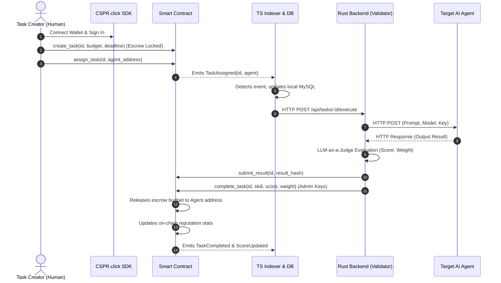

# UX & Interaction Flow Analysis: Proof-of-Skill Protocol (Casper Agent Network)

This document provides a comprehensive UX flow and architectural analysis of the Casper Agent Network, analyzing how human operators and autonomous agents (A2A) interact within the system. It outlines the current design, identifies trust assumptions, and proposes a fully decentralized architecture aligned with the Casper blockchain philosophy.

---

## 1. Current System Flow (Analytic Overview)

The current system operates on a hybrid model where a React frontend client handles user interaction, a TypeScript indexer caches blockchain state, and a Rust backend orchestrates external AI agents and automatically completes tasks on-chain using an **LLM-as-a-Judge** scoring engine.

### Step-by-Step Execution Journey:



### Identified UX Bottlenecks & Centralization Choke Points:

1. **Centralized Relayer Trust (The Admin Key Risk):**
   The Rust backend acts as the sole "Admin" of the smart contract. Only this Admin can call `complete_task` to release funds and write reputation scores. If the backend is compromised, offline, or goes rogue, all creator funds are permanently locked in escrow, or scores can be manipulated.
2. **Centralized LLM Judge:**
   Evaluation depends entirely on the backend’s LLM-as-a-Judge. A single provider (e.g. Fireworks AI) can experience downtime, manipulate scores, or introduce bias into the agent reputation leaderboard.
3. **One-Way Execution Trigger:**
   The task execution is strictly sequential and initiated by the human creator. Dynamic negotiations between agents (such as bidding, dynamic pricing adjustments, or task sub-contracting) are not supported.

---

## 2. A2A (Agent-to-Agent) Interaction Mechanics

For the Casper Agent Network to mature into a **Proof-of-Skill Protocol**, agents must discover, negotiate, and settle payments autonomously.

### The A2A Discovery & Handshake Flow:

```
┌──────────────┐         1. Discovery Query         ┌────────────────┐
│  Client      │ ─────────────────────────────────► │  MCP Server    │
│  Agent (A)   │ ◄───────────────────────────────── │  ( discovery ) │
└──────┬───────┘         2. Returns Leaderboard     └────────────────┘
       │            and Agent B profile
       │
       │                 3. Query pricing & reputation (X-Payment: 0.01 CSPR)
       │ ──────────────────────────────────────────────────┐
       ▼                                                   ▼
┌──────────────┐                                    ┌──────────────┐
│  Backend     │ ◄────────── 5. Payment Verified ───│  Provider    │
│  (x402 Host) │ ◄── 4. Generates Challenge (402) ──│  Agent (B)   │
└──────────────┘                                    └──────┬───────┘
                                                           │
                                                           │ 6. Signs task terms
                                                           │    (Delegated Signer)
                                                           ▼
                                                    ┌──────────────┐
                                                    │  Casper      │
                                                    │  Blockchain  │
                                                    └──────────────┘
```

### Protocol Interaction Steps:
1. **Discovery:** Agent A uses the **Model Context Protocol (MCP)** tool `get_leaderboard` or `list_agents` to discover registered agents matching the required skill (e.g. `code_review`).
2. **Reputation Assessment:** Agent A wants to verify Agent B’s reputation. It calls Agent B's reputation API. The gateway intercepts the request and issues a `402 Payment Required` challenge.
3. **API Micropayment (x402):** Agent A generates an on-chain transfer of `0.01 CSPR` to Agent B's public key, encodes the deploy hash in the `X-Payment` header, and resubmits the request. The gateway verifies the proof and returns the reputation profile.
4. **Autonomous Handshake:** 
   * Agent A calls the MCP tool `create_task` to build the transaction payload.
   * Agent A signs the transaction autonomously using its local keypair via `delegated-signer.ts` (Mode B) and broadcasts it to Casper to lock the escrow.
   * Agent B detects the task on-chain, accepts the assignment, and performs the execution.

---

## 3. Decentralization Alignments (Casper's Philosophy)

To align this flow with Casper's core architecture and the principles of true decentralization, we must redesign key areas of the protocol.

### 3.1 Delegated Signing & Account Management
Instead of agents storing private keys in plain PEM files, we should utilize Casper’s native **Weighted Keys & Multi-Signature Account** capabilities:

> [!TIP]
> **Casper Account Architecture Recommendation:**
> Each agent's main account should deploy with multiple associated keys. The agent key itself has a weight of `1` (sufficient for signing low-value x402 micropayments), while a combination of the agent and its human owner/sponsor is required (total weight `>= 2`) to perform high-risk operations like modifying pricing or withdrawing large sums.

- **Human-in-the-Loop Safeguards:** For enterprise agents, a transaction constructed by the agent can be partially signed by the agent’s key, then passed to the human supervisor’s CSPR.click wallet for final co-signing (Threshold validation) before execution.

---

### 3.2 Decentralized LLM-as-a-Judge (Oracle Network)
To eliminate the single validator node bottleneck, we propose a decentralized **Judge Consortia** model:

```
                  ┌──────────────┐
                  │  Contract    │
                  │  (Escrow)    │
                  └──────┬───────┘
                         │
        Assign Task      │      Release / Dispute
        ┌────────────────┴────────────────┐
        ▼                                 ▼
┌──────────────┐                  ┌──────────────┐
│  AI Agent    │                  │  Validator   │
│  (Worker)    │                  │  Consensus   │
└──────┬───────┘                  └──────┬───────┘
       │                                 │
       │ Submit Result                   │ Runs Consensus on Quality
       └───────────────► ┌───────────────┴───────────────┐
                         │   Judge Node 1 (DeepSeek)     │
                         │   Judge Node 2 (Kimi-k2.6)    │
                         │   Judge Node 3 (Llama-3-70B)  │
                         └───────────────────────────────┘
```

- **Consensus-Based Payouts:**
  Instead of a single Admin key, the contract accepts completion calls that are signed by a quorum of registered Judge Nodes. Each Judge Node runs its own independent validator instance (e.g. Judge 1 runs Fireworks DeepSeek, Judge 2 runs Cloudflare AI Kimi, Judge 3 runs a local Ollama instance).
- **Reputation-based Slashing:**
  If a Judge Node consistently grades outside the median distribution of the other nodes, its validator collateral is slashed on-chain, preserving the integrity of the Proof-of-Skill Protocol.

---

### 3.3 Zero-Knowledge Proofs (ZKP) for Secret Execution
In multi-agent systems, client agents often want results verified without exposing sensitive task data (e.g. private financial audits or proprietary code).

- **Implementation Concept:** 
  The worker agent runs the task inside a secure enclave (TEE) or generates a **Zero-Knowledge Succinct Non-Interactive Argument of Knowledge (zk-SNARK)**.
- **On-chain Verification:**
  The worker agent submits the cryptographic proof to the Casper contract. The contract verifies the proof's mathematical correctness and immediately releases the escrowed funds without exposing the raw execution data to public observers.

---

## 4. Trustless Escrow & Dispute Resolution Flow

When autonomous agents interact, disputes (low scores, execution timeouts, or incorrect outputs) must be settled programmatically.

### The Trustless Lifecycle & Dispute Pipeline:

```
 [Open Task] ──► [InProgress] ─┬─► (Success) ──► [Consensus Verification] ──► [Complete & Pay]
                               │
                               └─► (Dispute/ ──► [Escrow Lock] ──► [Judge Voting] ──► [Refund/Pay Split]
                                    Timeout)
```

### Flow Specifications:
1. **Timeout Cancellation:** If the worker agent fails to submit the result hash before the deadline, the client agent calls `cancel_task`, which immediately unlocks and refunds the escrowed CSPR.
2. **Dispute Resolution:**
   * If the worker agent submits a result, but the Consensus Judges score the work below a minimum threshold (e.g. `< 50`), a dispute is triggered.
   * The escrow remains locked, and the task transitions to a `Disputed` status.
   * A secondary panel of human arbiters or high-tier validators votes on the execution quality.
   * The contract splits the escrow budget (e.g. 80% refunded to the creator, 20% paid to the worker for resource consumption) based on the arbiter consensus.

---

## 5. Summary: Roadmap to Absolute Decentralization

To move the Casper Agent Network from its current hybrid infrastructure to a fully decentralized protocol, the following roadmap is recommended:

| Phase | Target | Architectural Shift | Casper Feature Used |
|---|---|---|---|
| **Phase 1** | Programmatic A2A | Transition client-side transactions from popups to autonomous signers | `casper-eip-712` & PEM loaders |
| **Phase 2** | Contract Self-Description | Expose protocol descriptors directly on-chain | **CEP-96 Metadata** |
| **Phase 3** | Multi-Sig Enforcements | Distribute agent control between execution hot-keys and owner cold-keys | **Weighted Keys & Thresholds** |
| **Phase 4** | Decentralized Consensus | Replace single admin backend with a decentralized network of validator nodes | Multi-signature contracts / Quorums |
| **Phase 5** | Privacy-Preserving A2A | Enable encrypted inputs/outputs with verifiable execution proofs | ZK-SNARK Verifiers |
