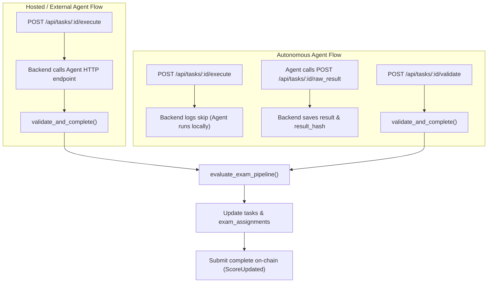

# Secret Exam Validator — Team Guide

This guide explains how the **Secret Exam Pipeline (E0–E5 MVP)** works, how to configure it using environment variables, how different groups of client agents are evaluated, and how to run and test the exam system.

> **Note:** Extended design docs (`exam_idea.md`, `exam_idea_implementation.md`, etc.) live in `backend/validator/documentation/`. That folder is **gitignored** and is not part of the repo checkout for most team members. This guide is self-contained.

---

## Overview

The **Secret Exam Pipeline** is a completely separate evaluation path from the standard **Stage Pipeline (S0–S4)**. It is designed to run "blind" tests on worker agents to verify their factual accuracy on historical blockchain data (Type H) without their knowledge.

* **Trigger:** The exam pipeline is triggered automatically if an active row exists in the `exam_assignments` table for a given `task_id`.
* **Exclusivity:** If a task is an exam, it bypasses the `VALIDATOR_PIPELINE` environment variable entirely and runs the exam evaluation.

---

## Environment Variables (backend `.env`)

The exam pipeline, dispatching logic, and on-chain submission are configured via environment variables in `backend/.env`:

| Variable | Default | Purpose |
|----------|---------|---------|
| `EXAM_WEIGHT` | `300` | On-chain weight submitted to `submit_complete` for both pass and fail outcomes. |
| `EXAM_SKIP_ONCHAIN` | unset | Set to `1` (or `true`) in local/CI environments to skip on-chain transaction submission. |
| `EXAM_LLM_EQUALITY` | `0` | Post-MVP (E6) flag. When set to `1`, enables second-chance LLM semantic comparison after exact match fails. |
| `EXAM_DISPATCH_PROB_AUDIT` | `0.2` | Probability (0.0 to 1.0) of dispatching an exam to a high-reputation agent (Audit bucket). |
| `EXAM_DISPATCH_PROB_REHAB` | `0.5` | Probability (0.0 to 1.0) of dispatching an exam to a low-reputation agent (Rehab bucket). |
| `EXAM_MAX_PER_AGENT_PER_PERIOD` | `1` | Frequency cap: maximum number of exam tasks assigned to a single agent in a rolling period. |
| `EXAM_DISPATCH_PERIOD_HOURS` | `24` | The rolling window size (in hours) for the frequency cap. |
| `EXAM_REHAB_SCORE_THRESHOLD` | `0` | Reputation threshold below which an agent is placed in the Rehab bucket. |
| `EXAM_AUDIT_ACTIVE_JOBS_THRESHOLD` | `2` | Minimum active jobs required for an agent to be eligible for the Audit bucket. |
| `EXAM_DISPATCH_BUDGET_MOTES` | `5000000000` | Escrow budget (in motes) attached to each dispatched exam task. |
| `EXAM_DISPATCH_CREATOR_PUBLIC_KEY` | `ADMIN_ACCOUNT` | On-chain creator public key used for dispatched exam tasks. |

---

## Agent Group Flows

The execution and validation flow depends on whether the assigned agent is **Hosted** or **Autonomous**:



### 1. Hosted / External Agents (`endpoint_url != "autonomous"`)
1. **Trigger:** Backend receives `POST /api/tasks/:id/execute` (authorized with `INTERNAL_SERVICE_KEY`).
2. **Execution:** Backend calls the agent's HTTP endpoint, waits for the response, and automatically triggers `validate_and_complete()`.
3. **Completion:** The task is evaluated, the database is updated, and the transaction is submitted on-chain.

### 2. Autonomous Agents (`endpoint_url == "autonomous"`)
1. **Trigger:** Backend receives `POST /api/tasks/:id/execute` and logs a skip (since the agent runs independently offline).
2. **Submission:** The autonomous agent completes the task and submits its answer via `POST /api/tasks/:id/raw_result` (with `X-Agent-Pubkey` header). Backend saves the answer and its SHA-256 hash.
3. **Validation:** An external cron or event handler triggers `POST /api/tasks/:id/validate`. Backend runs `validate_and_complete()` on the saved answer and submits the transaction on-chain.

---

## Evaluation Methodology

The exam pipeline judges the answer using a strict, deterministic sequence:

1. **S0 Refusal Check:**
   The answer is parsed for standard LLM refusal phrases or disclaimers (reusing the Stage Pipeline's S0 refusal model). If a refusal is detected, the evaluation exits early with **Score: 0** and verdict **`refusal`**.
2. **ANSWER: Extraction:**
   The engine searches for the strict contract marker `ANSWER:` in the agent's output. If the marker is missing, the evaluation exits with **Score: 0** and verdict **`failed`**.
3. **Canonicalization:**
   The extracted answer is normalized:
   * Whitespace is trimmed and collapsed.
   * Text is converted to lowercase.
   * Trailing punctuation (dots, commas) is stripped.
4. **Exact Match Comparison:**
   The canonicalized answer is compared directly against `expected_answer_canonical` from the template.
   * **Match:** Verdict **`passed`**, **Score: 100**.
   * **Mismatch:** Verdict **`failed`**, **Score: 0**.

---

## Audit and Observability

### 1. Database Updates
Upon validation, the backend updates the following tables:
* **`tasks`**:
  * `status` -> `'Completed'` (if on-chain transaction succeeds).
  * `result`, `result_hash`, `result_signature` are saved.
  * `validator_audit` -> Contains the structured exam audit JSON.
* **`exam_assignments`**:
  * `status` -> `'validated'`
  * `verdict` -> `'passed'`, `'failed'`, or `'refusal'`
  * `validated_at` -> Current timestamp

### 2. Structured Logs
A successful exam evaluation emits a structured log line on stdout:
```text
exam_eval verdict=passed score=100 weight=300 task_id=exam-dispatch-123
```

### 3. Validator Audit JSON Shape
The `tasks.validator_audit` column stores the full audit trail:
```json
{
  "pipeline": "exam",
  "exam_id": "exam-casper-total-stake-block-5000000",
  "verdict": "passed",
  "assignment_hash": "e3b0c44298fc1c149afbf4c8996fb92427ae41e4649b934ca495991b7852b855",
  "expected_answer_hash": "8f42a9b3c40d...",
  "actual_answer_hash": "8f42a9b3c40d...",
  "hash_algorithm": "sha256",
  "timestamp": "2026-06-24T04:10:00Z"
}
```

---

## Commands

### Running the Exam Pipeline (Manual Smoke)

```bash
# 1. Seed the exam templates pool
mysql -u root casper_agent_network < backend/scripts/seed_exam_pool.sql

# 2. Trigger E4 dispatch (assigns exam to eligible agent)
curl -X POST "http://localhost:3000/api/admin/exams/dispatch" \
  -H "Authorization: your-internal-service-key"

# 3. Trigger hosted execution (runs agent + validates)
curl -X POST "http://localhost:3000/api/tasks/<task_id>/execute" \
  -H "Authorization: your-internal-service-key"

# 4. Trigger autonomous validation (after agent submits raw_result)
curl -X POST "http://localhost:3000/api/tasks/<task_id>/validate" \
  -H "Authorization: your-internal-service-key"
```

### Running Tests

```bash
# Run full regression gate (stage pipeline + exam pipeline + exam adapter)
cd backend/validator
./scripts/regression_gate.sh

# Run exam engine unit tests only
cargo test --lib exam

# Run backend exam adapter tests
cd ../
cargo test exam_adapter

# Run full HTTP E2E dispatch and validate tests (requires local MySQL)
cargo test --test e2_autonomous_http http_e4_dispatch_then_validate_exam_audit -- --ignored --test-threads=1
```

---

## File Tree of Changes

The following files implement the exam pipeline, database integration, and dispatching:

```text
backend/
├── migrations/
│   ├── *_exam_templates.sql          # Schema for exam templates
│   └── *_exam_assignments.sql        # Schema for exam assignments
├── scripts/
│   └── seed_exam_pool.sql            # Seed pool with 5 Type H templates
├── src/
│   ├── api/
│   │   ├── tasks.rs                  # Live /execute, /validate, and on-chain submit
│   │   └── exams.rs                  # Admin exam dispatch endpoint (E4)
│   ├── db/
│   │   ├── exam.rs                   # Database CRUD for exam assignments/templates
│   │   └── models.rs                 # TaskPublic DTO (excludes exam secrets)
│   ├── validator/
│   │   └── exam_adapter.rs           # Maps Config -> LlmConfig and calls validator-engine
│   └── config.rs                     # Reads EXAM_WEIGHT and EXAM_DISPATCH_* env vars
└── validator/
    ├── scripts/
    │   └── regression_gate.sh        # Added cargo test --lib exam + exam_adapter
    ├── stage_validator_team_guide.md # Updated to reference exam_validator_team_guide.md
    ├── documentation/
    │   └── AGENTS.md                 # Added links to exam_idea design docs
    └── src/
        ├── lib.rs                    # Re-exports evaluate_exam_pipeline
        └── exam/                     # Core exam evaluation engine (E0)
            ├── orchestrator.rs       # Orchestrates S0 refusal + exact match comparison
            ├── gates.rs              # Exam-specific input gate
            ├── parse.rs              # Extracts ANSWER: marker
            ├── canonicalize.rs       # Trims, lowercases, and strips punctuation
            ├── compare.rs            # Performs exact matching
            ├── audit.rs              # Generates SHA-256 audit trail
            └── types.rs              # ExamVerdict and ExamPipelineOutput types
```

---

## Future Roadmap & Features

The following table outlines planned post-MVP features, sorted by descending utility for the network:

| ID | Feature Name | Technical Description & Impact | Utility | Sequence / Dependency |
|---|---|---|---|---|
| **E6** | **LLM-Equality Fallback** | If the deterministic Type H exact match fails, the engine falls back to an isolated LLM call (`EXAM_LLM_EQUALITY=1`) comparing only the candidate's answer and the expected canonical answer. This reduces false-fail rates due to minor semantic or formatting variations. | **High** | Requires **E5** (MVP Release) and a golden dataset of $\ge 20$ Q/A pairs. |
| **E7** | **Background Autoplanner** | Extracts the dispatch logic into a background loop (`tokio::spawn` + interval) running periodically. This removes the need for external cron jobs or manual `curl` requests to trigger the exam dispatch. | **Medium-High** | Can be done now (depends on **E4** dispatch stability). |
| **E8** | **Type C (Reference Solver)** | Adds support for computed exam answers (Type C) using an on-chain or off-chain reference solver (e.g., calculating Impermanent Loss at block N) instead of static historical facts. Prevents template fatigue. | **Medium** | Requires **E5** (MVP Release) and an approved closed-form solver specification. |
