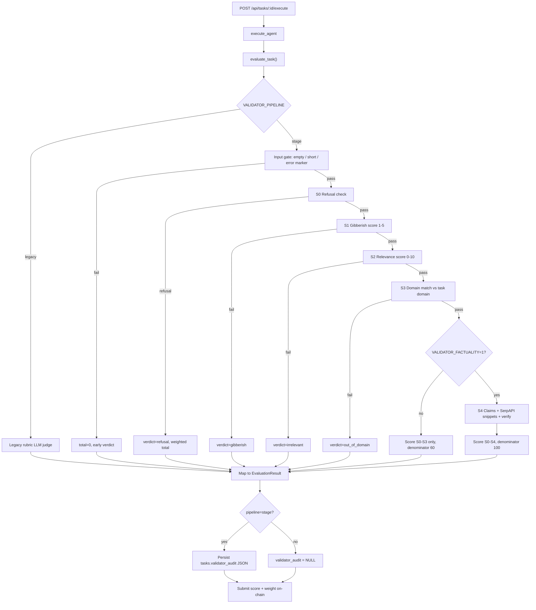

# Stage Validator — Team Guide

How to run the live validator, which flags to set, which LLM providers are used, and how the stage pipeline scores answers.

> **Note:** Extended design docs (`implementation.md`, `roadmap.md`, phase plans, etc.) live in `backend/validator/documentation/`. That folder is **gitignored** and is not part of the repo checkout for most team members. This guide is self-contained.

## Live `/execute` path

Production task execution calls `evaluate_task()` in the backend. Switch pipelines with:

| Variable | Value | Effect |
|----------|-------|--------|
| `VALIDATOR_PIPELINE` | `legacy` (default) | Single-LLM rubric judge (5 buckets) |
| `VALIDATOR_PIPELINE` | `stage` | Stage pipeline S0–S4 |

Set in **`backend/.env`** (see [`backend/.env.example`](../.env.example)).

**Rollback:** unset the variable or set `VALIDATOR_PIPELINE=legacy` — no code deploy required.

## Evaluation pipeline flow



**On-chain contract:** only `total` (0–100) is submitted. Weight is computed separately in `tasks.rs` from budget/domain. Legacy rubric fields and audit JSON do not affect the chain call.

## Stage methodology

The stage validator judges the **answer as an artifact** — it does not re-solve the task.

| Stage | Criterion ID | What it checks | Early exit verdict |
|-------|----------------|----------------|--------------------|
| S0 | `refusal_check` | Answer is a refusal / disclaimer | `refusal` |
| S1 | `gibberish_check` | Coherence and meaning (LLM score 1–5, min 3) | `gibberish` |
| S2 | `relevance_check` | Answer matches the question (0–10, min 6) | `irrelevant` |
| S3 | `domain_check` | Answer fits the platform-declared task domain | `out_of_domain` |
| S4 | `factuality_check` | Extract claims, search snippets, verify each claim | `hallucinated` / `unverifiable` / `factual` |

**Scoring:** each stage produces normalized quality ∈ [0, 1].  
`total = Σ (quality × weight) / Σ (weights of stages that ran) × 100`.

Default weights (from [`prompts/model_configs.yaml`](./prompts/model_configs.yaml)):

| Stage | Weight |
|-------|--------|
| Refusal | 10 |
| Gibberish | 15 |
| Relevance | 20 |
| Domain | 15 |
| Factuality | 40 |

With factuality **off** (default), only S0–S3 run and the denominator is **60**. With factuality **on**, S4 runs when S0–S3 pass and the denominator is **100**.

**Verdict vs total:** verdict is a category label; `total` is always returned (including early exit).

## Factuality (S4)

| Variable | Default | Purpose |
|----------|---------|---------|
| `VALIDATOR_FACTUALITY` | `0` | `1` = enable claim decomposition + search + verification |
| `SERPAPI_API_KEY` | — | Required for real search when `VALIDATOR_MOCK_LLM=0` |
| `VALIDATOR_MOCK_LLM` | unset | `1` = deterministic mock LLM + mock search |

S4 is **skipped** when:

- `VALIDATOR_FACTUALITY` is not enabled;
- `domain == code_review`;
- answer length is below ~200 characters after S3.

Per claim: up to **5 claims**, **3 snippets** each, in-memory search cache per evaluation.

## LLM providers

Stage pipeline uses the `validator-engine` provider chain. Configure in [`backend/validator/.env`](./.env) (template: [`.env.example`](./.env.example)):

1. **Cloudflare Workers AI** — `CLOUDFLARE_ACCOUNT_ID`, `CLOUDFLARE_API_TOKEN`
2. **OpenAI / compatible** — `OPENAI_API_KEY`, `OPENAI_BASE_URL`
3. **Claude** — `CLAUDE_API_KEY`
4. **Ollama** — `OLLAMA_URL`, `OLLAMA_MODEL`
5. **Custom / Fireworks** — `VALIDATOR_LLM_URL`, `VALIDATOR_LLM_API_KEY`, `VALIDATOR_LLM_MODEL`
6. **Mock** — `VALIDATOR_MOCK_LLM=1` (no API keys; CI and local smoke)

Additional tuning:

- `VALIDATOR_JUDGE_CASCADE=local_first|api_first` — fallback order
- `VALIDATOR_JUDGE_TIMEOUT_MS` — per-provider timeout (default 15000)
- `VALIDATOR_JUDGE_SELF_CONSISTENCY=1` — majority vote on ambiguous labels

Prompts and stage thresholds: [`prompts/model_configs.yaml`](./prompts/model_configs.yaml) and `prompts/stage_*.yaml`.

## Audit and observability

| Output | Where | When |
|--------|-------|------|
| `total` | On-chain submit | Always |
| `validator_audit` | DB column `tasks.validator_audit` | Only `VALIDATOR_PIPELINE=stage` |
| Structured log | Backend stdout | Stage path only |

Example log line:

```text
validator_eval pipeline=stage factuality_enabled=false factuality_ran=false verdict=factual total=92 llm_calls=4 search_hits=0 search_misses=0 stages=refusal_check:12ms,gibberish_check:8ms,...
```

Audit JSON shape:

```json
{
  "pipeline": "stage",
  "stats": {
    "llm_calls": 4,
    "search_cache_hits": 0,
    "search_cache_misses": 0,
    "stage_ms": [{ "id": "refusal_check", "elapsed_ms": 12 }]
  },
  "output": {
    "verdict": "factual",
    "stages": [],
    "criteria": [],
    "total": 92,
    "explanation": "..."
  }
}
```

Inspect via `GET /api/tasks/:id` after execute completes.

## Smoke and regression commands

```bash
# Validator crate — mock regression
cd backend/validator
VALIDATOR_MOCK_LLM=1 cargo test

# Stage S0–S3 manual smoke (real LLM if mock off)
cargo run --bin stage_pipeline_manual_smoke

# Factuality — mock regression
VALIDATOR_MOCK_LLM=1 VALIDATOR_FACTUALITY=1 cargo test stage_factuality

# Factuality — real search (requires keys)
VALIDATOR_FACTUALITY=1 SERPAPI_API_KEY=... cargo run --bin factuality_manual_smoke

# Backend cutover smoke
cd ../
VALIDATOR_PIPELINE=stage VALIDATOR_MOCK_LLM=1 cargo test --lib validator::
```

## Repo layout (what the team sees)

| Path | Role |
|------|------|
| [`README.md`](./README.md) / [`README.ru.md`](./README.ru.md) | Crate quick start |
| **This file** | Live validator usage for the team (Stage Pipeline) |
| [`exam_validator_team_guide.md`](./exam_validator_team_guide.md) | Live validator usage for the team (Secret Exam Pipeline) |
| [`prompts/`](./prompts/) | Stage prompts and runtime config |
| [`src/stage_pipeline/`](./src/stage_pipeline/) | Pipeline implementation |
| [`../src/validator/`](../src/validator/) | Backend adapters (`llm_judge.rs`, `stage_adapter.rs`) |
| [`../src/api/tasks.rs`](../src/api/tasks.rs) | Live `/execute` and `/validate` |
| `documentation/` | Internal design docs (**gitignored**, local only) |

## Parallel paths

| Path | Used for |
|------|----------|
| **Stage pipeline** | Benchmark (always) and live `/execute` when `VALIDATOR_PIPELINE=stage` |
| **Exam pipeline** | Secret exam tasks (`exam_assignments`). See [`exam_validator_team_guide.md`](./exam_validator_team_guide.md) |
| **Legacy judge** | Live `/execute` rollback when `VALIDATOR_PIPELINE=legacy` (default) |

## Limitations

- Factuality adds latency (search + per-claim LLM calls).
- Real search depends on SerpAPI quota and key.
- Default pipeline remains **legacy** until ops sets `VALIDATOR_PIPELINE=stage`.
